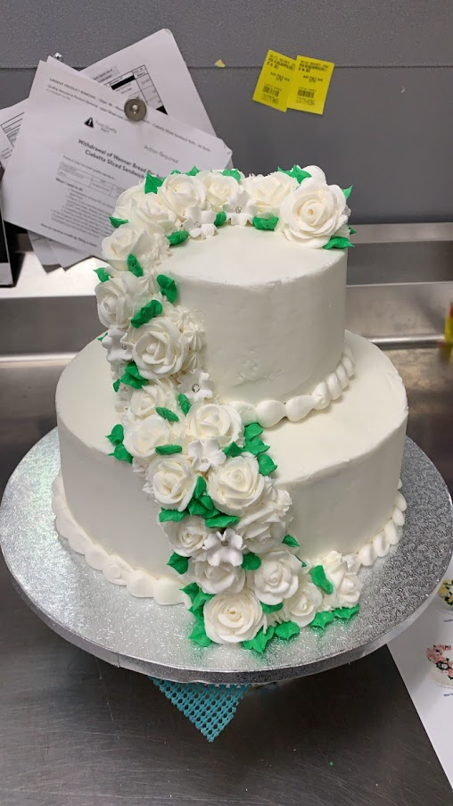
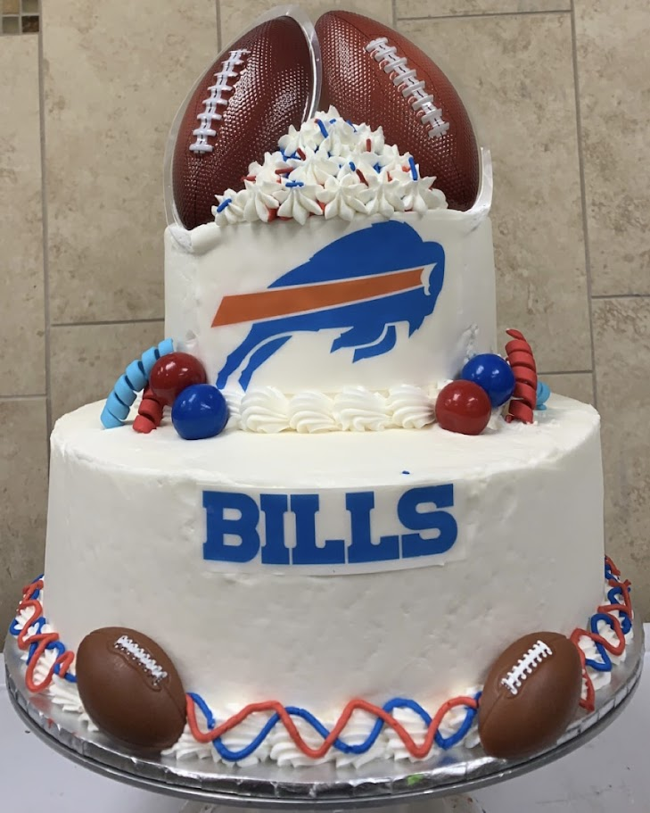
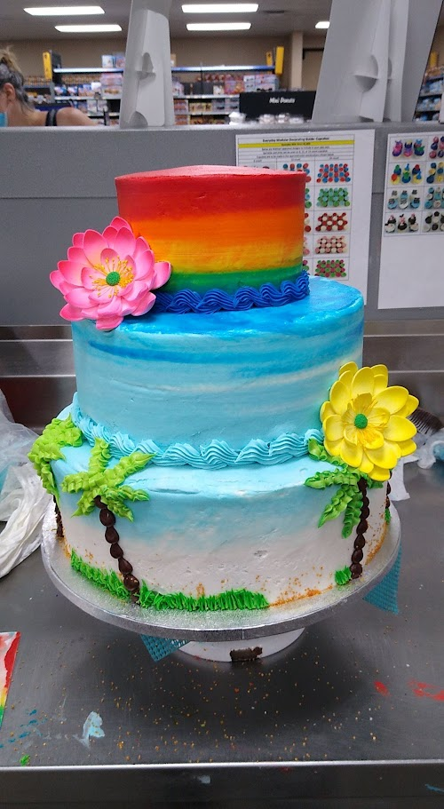
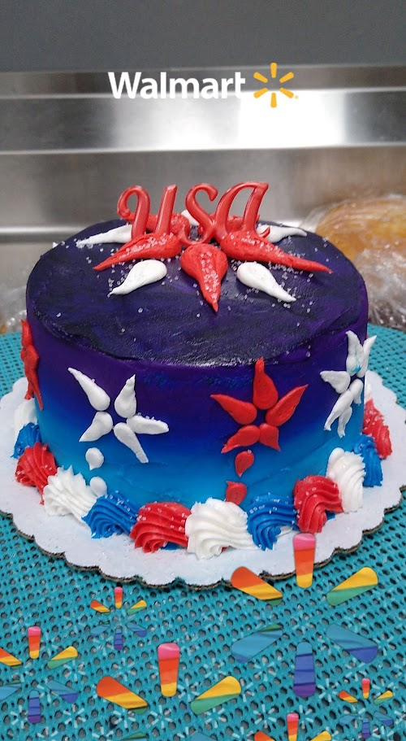
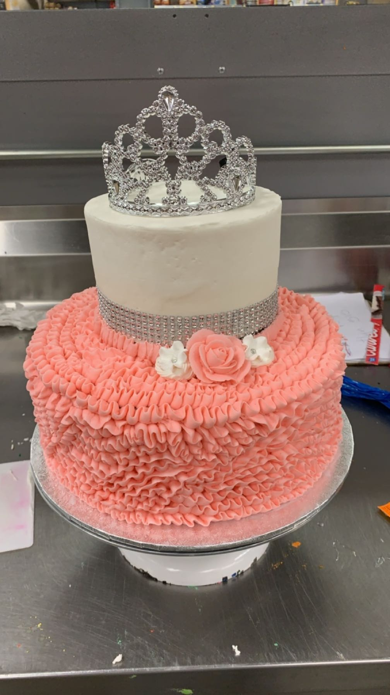
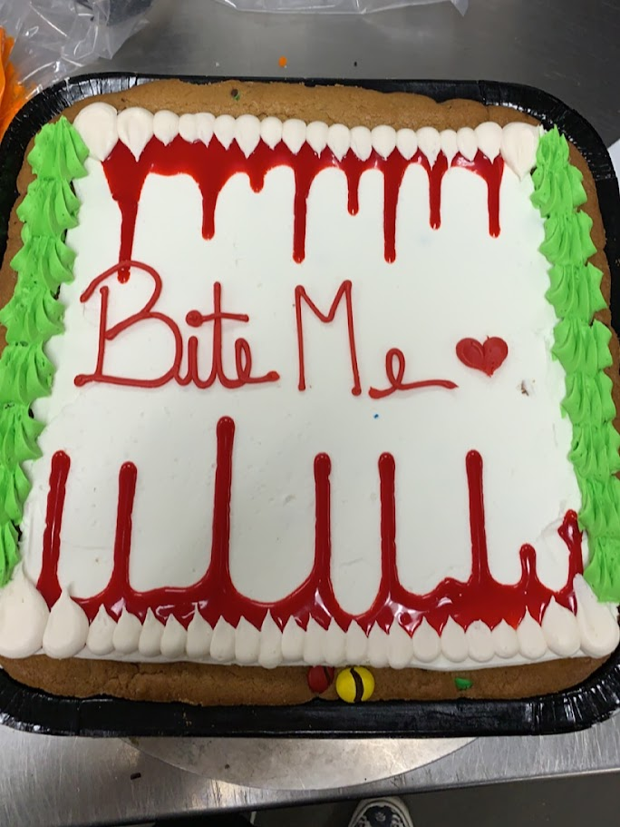
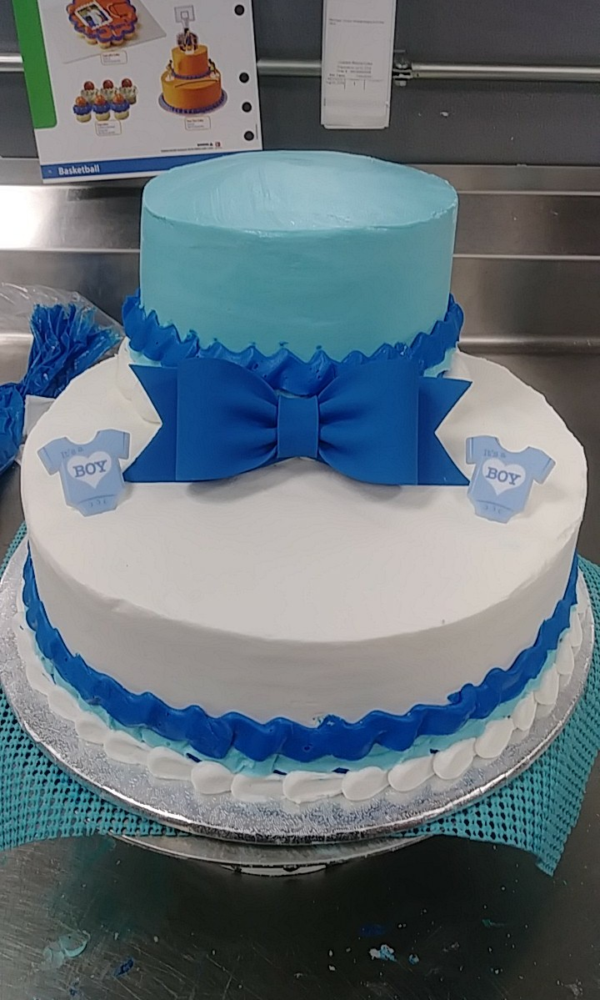
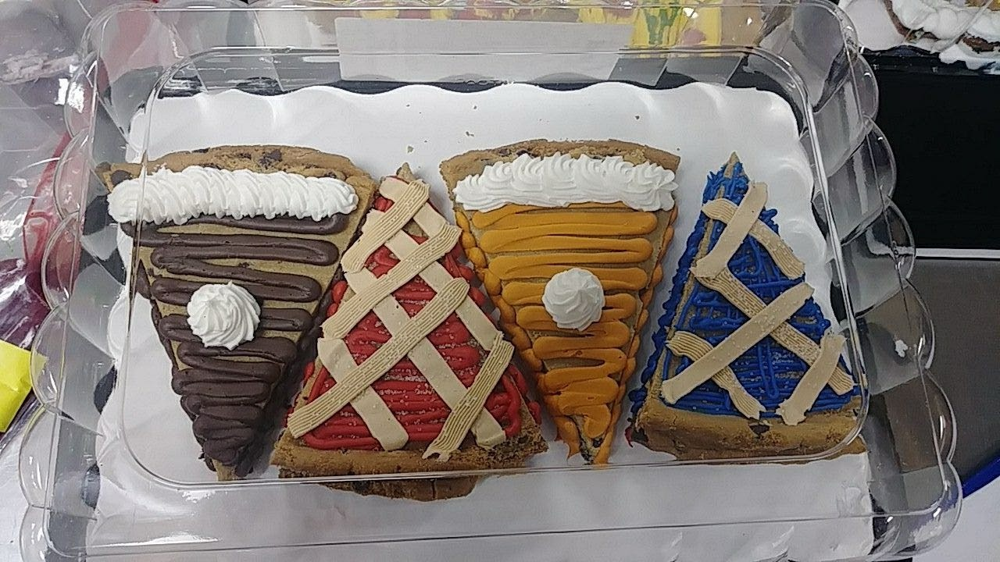
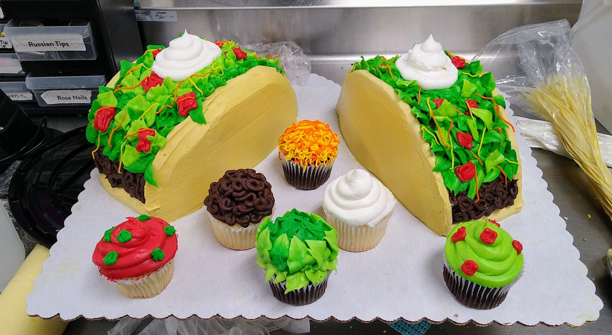

<!DOCTYPE html>
<html lang="en">
  <head>
    <meta charset="UTF-8" />
    <meta name="viewport" content="width=device-width, initial-scale=1.0" />
    <title><CV class="html"></CV></title>
    <link rel="stylesheet" href="mobile-first.css" />
    <link rel="preconnect" href="https://fonts.googleapis.com" />
    <link rel="preconnect" href="https://fonts.gstatic.com" crossorigin />
    <link
      href="https://fonts.googleapis.com/css2?family=Patrick+Hand&display=swap"
      rel="stylesheet"
    />
  </head>
  
  <nav>
    <ul class="main-nav">
      <li><a href="CV.html">Home</a></li>
      <li><a href="cakes.html">Cakes</a></li>
      <li><a href="contact.html">Contact</a></li>
    </ul>
  </nav>
  <header>
    <h1>Elizabeth McKenzie</h1>
    

    

      
Email: emckenzi1991@gmail.com

      
Phone: (716) 940-2966

      <a href="https://www.linkedin.com/in/elizabeth-mckenzie-1b0a4b1a2/">
        <button>Find Me On Linkedin</button>
      </a>
      <a href="https://github.com/emckenzi1991">
        <button>Find Me On GitHub</button>
      </a>
    

  </header>
  

  <body>
    <h2>Summary</h2>
    

      Re-entering the engineering field with renewed focus and updated skills.
      While working in other fields I focused on personal development and am now
      motivated and ready to bring renewed dedication and talent back to
      software engineering.
    

    <h2>Education</h2>
    <ul>
      <li>Newfane High School, Newfane, NY. Class of 2017</li>
      <li>
        Niagara County Community College, Sanborn, NY. 2017-2018 Mechanical
        Engineering, No Degree
      </li>
      <li>SpringBoard, Software Development Bootcamp, 2025-present</li>
    </ul>
    <h2>Skills</h2>
    <ul>
      <li>Retail Merchandising</li>
      <li>Customer Service</li>
      <li>Problem Solving</li>
      <li>Loss Prevention</li>
      <li>Team Leadership</li>
      <li>Cake Decorating</li>
    </ul>

    

      <h2>Experience</h2>
      <h3>Walmart, Team Lead. 2019-present</h3>

      <ul>
        <li>Lead and manage a team of 20 employees</li>
        <li>Analyze sales figures to track customer buying behaviors</li>
        <li>Facilitating Vendor Relations</li>
      </ul>

      <h3>Walmart, Cake Decorator. 2018-2019</h3>

      <ul>
        <li>
          Assisted customers with planning cake vision, including color, theme,
          and size
        </li>
        <li>
          Monitored inventory levels of baking supplies and alerted management
          when restocking was necessary
        </li>
        <li>Maintained a clean and organized work area</li>
      </ul>
      <a href="cakes.html">
        <button>Check out my cakes!</button>
      </a>
      <!--protflio of custom cakes-->

      <h3>Walamrt, Bakery\Deli Associate. 2017-2019</h3>
      <ul>
        <li>
          Operated ovens and other equipment to bake products according to
          established recipes
        </li>
        <li>Followed food safety guidelines while preparing all food items</li>
        <li>
          Attended training sessions related to food safety procedures and
          technique
        </li>
      </ul>
    

    <h2>Certification</h2>
    <ol>
      <li>
        Food Safety Manager- National Registry of Food Safety Professionals
      </li>
      <li>CPR and AED certified</li>
      <li>Forklift certified</li>
    </ol>
    <h2>Volunteer Work</h2>
    <ul>
      <li>Making Strides Against Breast Cancer</li>
      <li>Walk Out Of The Darkness</li>
      <li>Children's Miracle Network</li>
      <li>Niagara Honor Flights</li>
    </ul>
    

    <footer>
      <h3>Send Me a Message!</h3>
      <!-- Contact Form -->
      <form action="#">
        <label for="name">Name:</label>
        <input
          type="text"
          id="name"
          name="name"
          required
          placeholder="Jane Doe"
        />  

        <label for="email">Email:</label>
        <input
          type="email"
          id="email"
          name="email"
          required
          placeholder="JDoe@email.com"
        />  

        <label for="organization">Organization:</label>
        <input
          type="text"
          id="organization"
          name="organization"
          placeholder="Walmart"
        />  

        <label for="reason">Reason for Contact:</label>
        <select id="reason" name="reason" required>
          <option value="inquiry">General Inquiry</option>
          <option value="collaboration">Collaboration</option>
          <option value="feedback">Job Offer</option>
          <option value="other">Other</option></select
        >  

        <label for="message">Message:</label> 
        <textarea
          id="message"
          name="message"
          required
          rows="4"
          cols="50"
          placeholder="Enter Message Here &lt;3"
        ></textarea
        >  

        <button type="submit">Send Message!</button>
      </form>
      
Thank you for viewing my CV. I look forward to connecting with you!

    </footer>
    <!--https://stackoverflow.com/questions/32102747/how-to-make-a-back-to-top-button-using-css-and-html-only-->
    <a href="#top"> <button>back to top</button></a>
  </body>
</html>
<!DOCTYPE html>
<html lang="en">
  <head>
    <meta charset="UTF-8" />
    <meta name="viewport" content="width=device-width, initial-scale=1.0" />
    <title>Cakes</title>
    <link rel="stylesheet" href="mobile-first.css" />
    <link
      href="https://fonts.googleapis.com/css2?family=Patrick+Hand&display=swap"
      rel="stylesheet"
    />
    
  </head>
  <nav>
    <ul class="main-nav">
      <li><a href="CV.html">Home</a></li>
      <li><a href="cakes.html">Cakes</a></li>
      <li><a href="contact.html">Contact</a></li>
    </ul>
  </nav>
  <body>
    

      <h1>My Cake Portfolio</h1>
      

        Here are some examples of cakes I have decorated during my time at
        Walmart.
      

      <ul>
        <li>Teir Cakes</li>
        <li>Sheet Cakes</li>
        <li>Cookie Cakes</li>
        <li>Cupcakes</li>
        <li>Fruit Top Cakes</li>
        <li>Edible Images</li>
      </ul>
    

    

      
      
      
      
      
      
      
      
      
      
    

  </body>
  <a href="#top"> <button>back to top</button></a>
</html>
<!DOCTYPE html>
<html lang="en">
<head>
    <meta charset="UTF-8">
    <meta name="viewport" content="width=device-width, initial-scale=1.0">
    <title>contact</title>
     <link rel="stylesheet" href="mobile-first.css">
    <link rel="preconnect" href="https://fonts.googleapis.com">
    <link rel="preconnect" href="https://fonts.gstatic.com" crossorigin>
    <link href="https://fonts.googleapis.com/css2?family=Patrick+Hand&display=swap" rel="stylesheet">
</head>
  <nav>
    <ul class="main-nav">
      <li><a href="CV.html">Home</a></li>
      <li><a href="cakes.html">Cakes</a></li>
      <li><a href="contact.html">Contact</a></li>
    </ul>
  </nav>
<body>
    <h2>Send Me a Message!</h2>
            <!-- Contact Form -->
                <form action="#">
                    <label for="name">Name:</label>
                    <input type="text" id="name" name="name" required placeholder="Jane Doe">  

                    <label for="email">Email:</label>
                    <input type="email" id="email" name="email" required placeholder="JDoe@email.com">  

                    <label for="organization">Organization:</label>
                    <input type="text" id="organization" name="organization" placeholder="Walmart">  

                    <label for="reason">Reason for Contact:</label>
                    <select id="reason" name="reason" required>
                        <option value="inquiry">General Inquiry</option>
                        <option value="collaboration">Collaboration</option>
                        <option value="feedback">Job Offer</option>
                        <option value="other">Other</option>
                    </select>  

                    <label for="message">Message:</label> 
                    <textarea id="message" name="message" required rows="4" cols="50" placeholder="Enter Message Here &lt;3"></textarea>  

                    <button type="submit">Send Message!</button>
                </form>
                 
                 <a href="https://www.linkedin.com/in/elizabeth-mckenzie-1b0a4b1a2/">
      <button>Find Me On Linkedin</button>
      <a href="https://github.com/emckenzi1991">
      <button>Find Me On GitHub</button>
</body>
</html>

